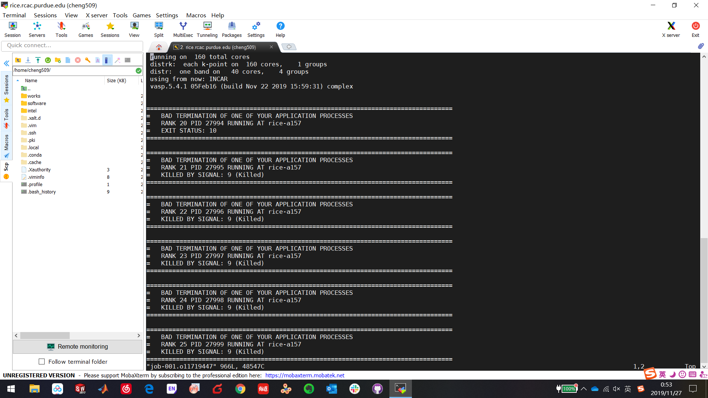

* content
{:toc}

# bug烦死人  

如我之前所说，在国内遇到的困难，这边也会遇到，都是些注定绕不过的坎。目前，我面前最大的一道坎就是VASP的安装问题————或者说————Linux系统里的软件安装问题。这也是模拟计算研究者们必然会遇到的问题。对于熟悉Linux系统的人来说，这个问题无疑会容易解决的多。可惜，我不属于这类人。偏偏我又不属于另一类————完全不懂Linux系统的人，这使得我时常产生“这问题我可以很快解决”的错觉。因此，进退两难，往往会把自己逼得情绪失控，甚至想要放弃。可是我又不能放弃，这使我痛苦。正所谓，不在沉默中爆发，就在沉默中灭亡。我不蠢，很清楚地知道在沉默中灭亡意味着什么。所以，尽管过程将会非常痛苦，但是失败的代价提醒着我————必须攻克这道难关！这可能就是我“修道”路上的“天雷劫”吧。撑过去了，将会得到巨大提升；撑不过去，只有死亡。  

那么，具体遇到的问题是什么呢？就是，每次用并行运算开多个核来做计算，就会发生同样的报错（如下图所示）。我把VASP重装了一遍，还是不行。向ITaP的工作人员求助，他们也没能给出有用的答复。冷静下来分析一下：我自己装的VASP和Riki给我的可执行文件在多核运算时都会出现同样的问题，说明可能的原因有几种。**第一，给我分配的户有问题，不能并行计算**；**第二，账户没问题，Riki给我的可执行文件和我自己编译安装的VASP都有错误，导致不能正常多核运算**；**第三，运算之前需要加载某些运行环境，我没有加载，导致不能多核运算**。要判断哪种假设成立，可以把Riki的可执行文件发给哲睿，并把我的计算文件一并发给他，让他在他的账户下提交任务（首先不加载任何环境），如果正常运算，则假设一成立；如果他也不能正常多核计算，就按他的提交习惯，加载运行环境然后提交任务，若正常运行，说明假设三成立，反之，则假设二成立。  
  

所以，为了不在沉默中灭亡，明天，我就要行动起来了，尽快确定发生问题的原因，解决它！时间如流水，转眼间美国之旅就过去了两个月，我得时刻提醒自己，不要荒废大好远离喧嚣的时光。其实，对于这个问题，我个人更倾向于假设二。如果真是假设二的话，那我就完全按照网上的教程，重装一遍VASP5.4.1。任正非说华为正处在创新大爆发的前夜，我何尝不是处在科研迈入新台阶的前夜呢？加油！(ง •̀_•́)ง
  

