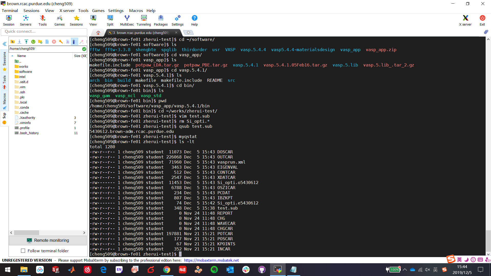

* content
{:toc}

# 遇到问题，先冷静分析原因，然后全神贯注扑到上面，坚持两天就行了，不行就坚持三天，再不行就一周！一定可以解决的！  

之前被vasp的运行问题搞到自闭！这回下定决心解决它，经过我连续两天地反复编译尝试，终于在今天下午成功了！同时安装了VASP.5.4.1（from 哲睿）和vasp。5.4.4（from 徐老师）。  

首先说原因，的确是vasp编译的问题导致之前的错误，但我不能确定是不是由于impi的原因。所以这回我干脆用openmpi编译得了。在网上找了不下10个安装教程，最终采用了<http://bbs.keinsci.com/thread-4267-1-1.html>的教程，终于成功了，尽管过程相当曲折。首先安装openmpi的最新版本4.0.2就遇到了问题，各种装不上，装上了之后执行“which mpif90”发现路径还是impi的mpif90，没办法只能clean之后重装，终于装好了。然后编译vasp,尝试了一两次之后也成功了，一运行，各种报错，不是找不到可执行文件，就是不能正常启动并行计算，搞得我头都大了。于是想着是不是Intel版本不对，于是换了2017版本，发现还是行不通。幸亏我没放弃，想着一路到这少说也装了10遍了，再多装一遍也没啥，估计是openmpi的版本不对头。于是，一狠心干脆把自己装的openmpi4.0.2统统删除干净（装这个可是折腾了我好久，就这么删了怪可惜的），然后module集群上默认的openmpi.2.1.6，再来重新编译。这次一次就成功了，perfect！然而九九八十一难好像还差一难——提交任务老是一片空白，压根儿没打开vasp。这时候一定要冷静，不能让这最后一根稻草给压倒了！嗯，再仔细检查，多尝试几次。发现问题的所在了，原来是提交任务脚本里需要加入“bash /home/cheng509/.profile”，我猜原因可能是编译vasp用到的fftw的库的路径需要export一下，我也懒得验证了，反正能正常运行了。开森!  

# 后记  

阳光总在风雨后，这句话是没错的！前提是你得坚持到阳光出来的那一刻！  
加油！  

# 另外一点小事  

> - Cyber Monday大出血花400刀买了一副<b>Sennheiser Momentum 3 Wireless</b>，用ebates拿到15%的返现了。尽管很贵，但是毕竟森海塞尔，真香！  
> - 拿到森海之后偶然看了一下akg的官网，发现折扣力度大的夸张。<b>N5005居然只要500刀，N40居然只要145刀！</b> 好想要！要知道N5005目前的京东价是8000元人民币，活动或淘宝最低价也得4500（国内几乎遇不到）！然而钱包空了，哈哈哈！幸好钱包空了！要不明年再买吧   

  

